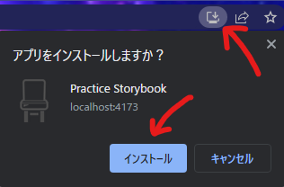
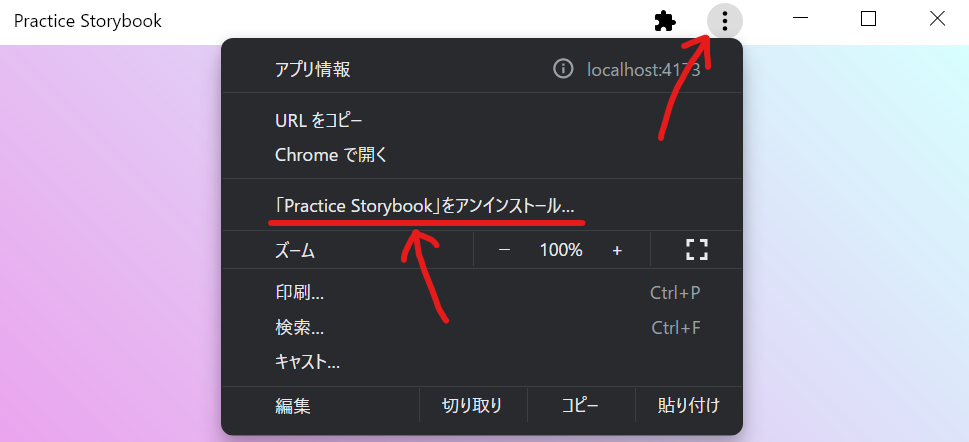
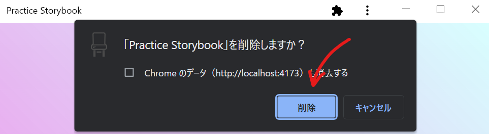

# Practice Storybook

## 概要

Storybook と React を組み合わせた開発の練習をするためのリポジトリです。

ビルドツールには Vite を採用し、 Storybook を起動するときにも利用しています。  
またモック API として MSW を採用し、 Storybook と Jest を実行するときに利用しています。

Jest に関しては高速化のために、 @swc/jest を利用しています。

## 使用している主なライブラリ

- React: 17.0.2
- MUI: 5.4.0
- Vite: 2.7.13
- Storybook: 6.4.18
- MSW: 0.36.8
- Jest: 27.5.0

## 開発に必要なもの

- WSL2
- Docker Desktop
- Remote Container (VS Code Plugin)

## PWA

⚠️🚧 PWA はまだまだ調査中です。  
インストールすることができたので、そのあたりについて記載しています。

### インストールする

ローカル環境で開発した Web アプリをインストールするためには、ビルドし、それを起動する必要があります。  
そのため、まずは以下のコマンドを実行します。

```bash
yarn build
yarn preview
```

ブラウザで開き、アドレスバーに表示されているインストールボタンをクリックし、インストールする。



### アンインストールする





## 実行例

### 開発モードでアプリを起動する

```bash
yarn dev
```

### Storybook を起動する

```bash
yarn storybook
```

### スナップショットテスト

#### スナップショットを取得する

```bash
yarn test:snapshot
```

#### スナップショットを更新する

```bash
yarn test:snapshot -u
```
